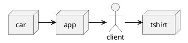

# BBC Online: Architecting for Scale with the Cloud and Serverless

* Link: https://www.youtube.com/watch?v=WE-tkz2tf30

## Requirements

* **High Traffic**: Global and Highly Variable
* **Broad Range of Content**: Created by Multiple Teams
* **Good Value**: Quick to Build Affordable to run

